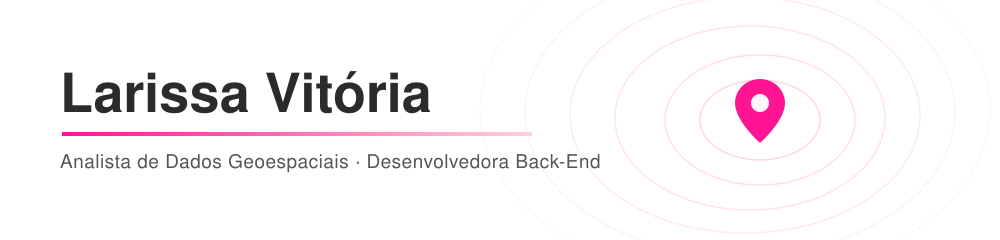
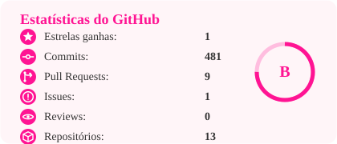
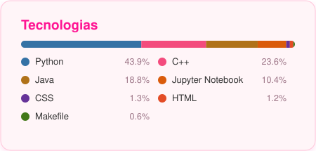

Graduanda em Engenharia de Computação pela Universidade Federal do Ceará (UFC).
Atuo como Analista de Dados com foco em <b>dados geoespaciais</b> e como <b>Desenvolvedora Python</b>,
com experiência em <b>back-end georreferenciados</b> e <b>sistemas especialistas</b>.

    
    

 

<h2 align="center">Atualmente</h2>

Estudando temas aplicados a dados geoespaciais:

  
  
  

 

<h2 align="center">Stack</h2>

  
  
  
  
  
  
  

 

<h2 align="center">Estatísticas</h2>

    
    &nbsp;&nbsp;
    

